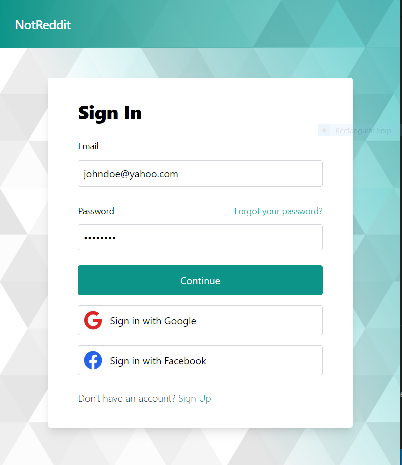
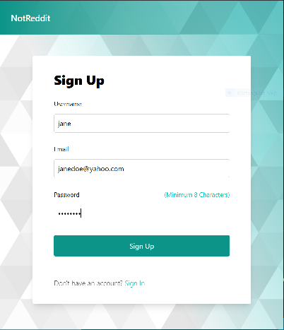

# React-Amplify-Auth

 


> User Login and Registration with authentication using CRA and AWS Amplify.

---

### Table of Contents

- [Description](#description)
- [How To Use](#how-to-use)
- [License](#license)

---

## Description

This application provides user login and registration authentification implemented by AWS Amplify. Existing users are able to sign in to the application using their email or social provider credentials.

New users are created and added to the Amazon Cognito UserPool upon email sign-up and confirmation. The app also provides user sign-out functionality facilitated by AWS Amplify and Amazon Cognito.

### Technologies

- React : v18.1.0
- AWS-Amplify: v4.3.24
- Tailwind CSS: v3.0.24

---

## How To Use

#### Fork and Clone Repository

```
git clone https://github.com/amehi0index/React-Amplify-Auth.git
```

#### Install dependencies
```
npm install
```

#### Install & configure the AWS Amplify CLI. Detailed instructions can be found [here](https://docs.amplify.aws/cli/start/install).

```
npm install -g @aws-amplify/cli

amplify configure
```
#### Initialize a new Amplify project following these [guidelines](https://docs.amplify.aws/cli/start/workflows/).
```
https://docs.amplify.aws/cli/start/workflows/
````

Set up your Auth provider(s) for Social sign-in (OAuth) using these [guidelines](https://docs.amplify.aws/lib/auth/social/q/platform/js/).
```
https://docs.amplify.aws/lib/auth/social/q/platform/js/
```

#### To run the applicaton 
```
npm start
```

---

## License

This project is licensed under the [MIT License](#LICENSE.txt)


[Back To Top](#react-amplify-auth)
